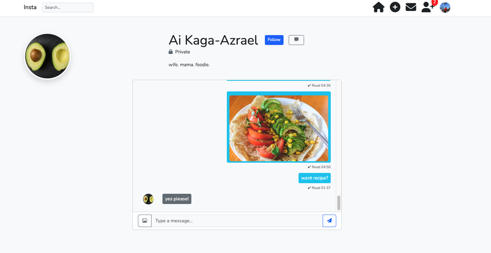

# Laravel Instagram Clone 📸



A simple Instagram-like app built with Laravel.  
Users can register, log in, post content (including videos), like posts, and chat with each other.

---

## 🚀 Features
- User Registration & Login
- Post creation with Image or Video
- Like and Unlike posts
- Follow and Unfollow users
- Direct Messaging (Chat)
- User Profile Pages
- Notifications for Follow Requests
- Responsive Design

---

## 🛠️ Technologies Used
- PHP 8.x
- Laravel 10
- SQLite (for easy local setup)
- Bootstrap 5 (for styling)
- Blade Templating Engine

---

## ⚙️ Installation
1. Clone this repository:
    ```bash
    git clone https://github.com/YOUR-USERNAME/laravel-insta.git
    cd laravel-insta
    ```
2. Install dependencies:
    ```bash
    composer install
    npm install && npm run dev (optional for frontend assets)
    ```
3. Copy `.env.example` and create your `.env` file:
    ```bash
    cp .env.example .env
    ```
4. Generate an application key:
    ```bash
    php artisan key:generate
    ```
5. Set up database:
    - Using the included `database/database.sqlite`
    - In `.env`:
        ```
        DB_CONNECTION=sqlite
        DB_DATABASE=/absolute/path/to/database/database.sqlite
        ```

6. Run migrations:
    ```bash
    php artisan migrate
    ```

7. Serve the application:
    ```bash
    php artisan serve
    ```

---

## 📄 License
This project is licensed for educational and portfolio purposes.
